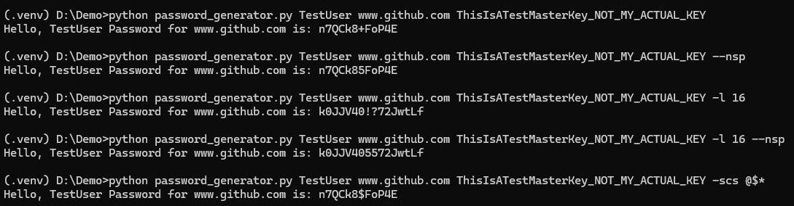

# Password Generator: Python Command-Line Tool

**Password Generator** is a Python-based command-line interface (CLI) tool designed to deterministically generate a password for a particular name, site and master key. It takes away the hassle of creating, remembering or storing strong passwords.

---

## Table of Contents

- [Features](#features)
- [Installation and Usage](#installation-and-usage)
- [Options](#options)
- [Explanation](#explanation)
- [Future Scope of Improvement](#future-scope-of-improvement)
- [Final Thoughts](#final-thoughts)

---

## Features

- **Easy-to-use CLI**: Simple commands with clear options and arguments.
- **Cross-platform**: Works on Linux, macOS, and Windows.
- **Deterministic**: Passwords stays the same until the input parameters change.
- **Variable Usage**: You can customize your password length, allowed special characters or whether to even have special characters in the first place.
- **No Storage, No Logging, No Caching**: Based on Cybersecurity ZTM (Zero Trust Model), it is ensured that no password is stored anywhere.

---

## Installation and Usage

Ensure you have **Python 3.11+** recommended. (Tool is developed using Py 3.13). All packages are included within the standard python library. No additional packages are required to be installed.

- Clone the repository and run locally:
  ```git clone https://github.com/Rohak-Git-Gud/password-generator-py.git```
- Navigate into repo:
  ```cd password-generator-py```
- Since, no additional packages are required, you can skip venv creation if you don't want it. (Though recommended)
- Execute password_generator to read manual:
  ```python password_generator.py -h``` (for Windows) or 
  ```python3 password_generator.py -h``` (for Linux or macOS)

---

## Demonstration

**Manual**


**Usage Showcase**


**Error Handling**


---

## Options

### Required Arguments

| Option | Description |
|--------|-------------|
| `name` | your name or identifier |
| `site` | service or website name<br>Note: "www.github.com" is different from "github.com" |
| `master_key` | your master key/passphrase<br>Make sure it is something you remember but not that obvious to figure out |

### Optional Arguments

| Option | Description |
|--------|-------------|
| `-h`, `--help` | show this help message and exit |
| `-l`, `--length` | password length<br>Min. 8 characters (default: 12) |
| `--nsp` | flag to exclude special characters from password generation (default: True) |
| `-scs`, `--specialC` | use it to change the acceptable special characters used<br>Not recommended, unless you know what you're doing (default: !@#$%^*-+_=?) |

---

## Explanation

- The entry point starts the `main` function.
- Inside `main` function:
    1. A Python Argument Parser object is created by `parser_creator` and captured argument values are stored.
    2. A dictionary of parameters is created so that future functions calls don't become messy.
    3. A seed is generated using `seed_creator` and stored in the dictionary.  
      _(This is important for the underlying math. We want the passwords that are generated to be random but **deterministic**.  
      Reason being, we want the same password every time the **exact same parameters** are provided to the program.)_
    4. To improve performance, resource delocation and delayed allocation in dictionary is carried out.
    5. Password is generated using `pass_creator`; and then printed.
- Inside `parser_creator` function:
    1. A Python Argument Parser is initialized with relevant data & a custom help formatter.
    2. Required and optional parameters are added to the parser; along with a custom password length error handler.
    3. Return the parser object that is created. 
- Inside `seed_creator` function:
    1. A string, generated from input parameters, becomes the initial seed on which the remaining algorithm depends upon.
    2. A 3-character salt is randomly generated.
    3. A new string is created using salt and shuffled input parameters.
    4. A **SHA3 (256 BIT)** hash is created from the new string; which is then converted to a hexadecimal string.
    5. Only a portion of the hexadecimal string is returned as seed.
- Inside `pass_creator` function:
    1. Previously generated seed is initialized.
    2. Each password will have at least 1 lowercase, digit, uppercase, each.
    3. Remaining characters will be generated from the alphanumeric ranges: 0-9, A-Z, a-z.
    4. If special characters are to be included in the password:  
       a few characters after the 3rd character will be swapped with a special character.
    5. Return the password string.

---

## Future Scope of Improvement

- [x] **Demo Showcase:** Complete current project demo with some usage examples and error handling.
- [x] **Refactoring:** Implement design principles and follow best programming practices.
- [x] **Better Documentation:** Explanation seems too detailed. Rephrase and rethink overall explanation and code comments.
- [ ] **Non Tech Inclusivity Provision:** For in case [someone like them](https://www.reddit.com/r/github/comments/1at9br4/i_am_new_to_github_and_i_have_lots_to_say/) happens to ponder here.
  - It can be an executable (*EXE*).
  - It can be an app (*GUI*).
  - It can be an endpoint (*API Server*).
- [ ] **Batch Generation:** Option to generate multiple passwords at once.
 (having same `name` and `master_key`)
  - Can be done by using looping until exit.
  - Can be done by having `site` and other optional arguments being fetched from a txt/json/csv file.
- [ ] **Making `name` Optional:** By making `master_key` include both name as well as master key,
 we can reduce the number of arguments, thus decreasing complexity of usage.
- [ ] **Better Master Key Handling:** Option to fetch `master_key` from systems' environment variables.
 (keeping all OSs in mind for continued cross platform usage)

---

## Final Thoughts

- Thank you for exploring this project. I hope you found it useful and insightful. 
The aim of this project was for me to create something without any handholding, 
and something that I actually would use in my day to day life, something practical.
  - If you have any feedback, suggestions, improvements or if you encounter any issues, 
feel free to open an issue or submit a pull request. Although, collaboration and contributions are always welcome, 
don't just update this README for the sake of putting an open-source contribution onto your resume.

- Secondly, This project aims to showcase and encourage good security practices, 
with the hope of making them a more natural part of everyday routine. Hence, take your own security serioursly.
  - Make sure your terminal/command prompt isn't storing history of commands you used to generate passwords. 
  (Try restarting your terminal/command prompt and press ⇡ to verify that your older commands don't show up)
  - Make sure the combination used to generate your password isn't accessible to a potential bad actor.

- Finally, I would like to thank **`Maarten Billemont (Lhunath)`** for inspiring me to create this project. His work on **`Spectre (https://spectre.app/)`** piqued my curiosity to recreate it with my logic and thought process, using the tools I'm comfortable with.
  - I encourage others to look around and find open-source projects that intrigue you. Try to recreate it on your own terms; don't blatantly clone or rip-off someone's repo, acknowledge your source of inspiration.

---
